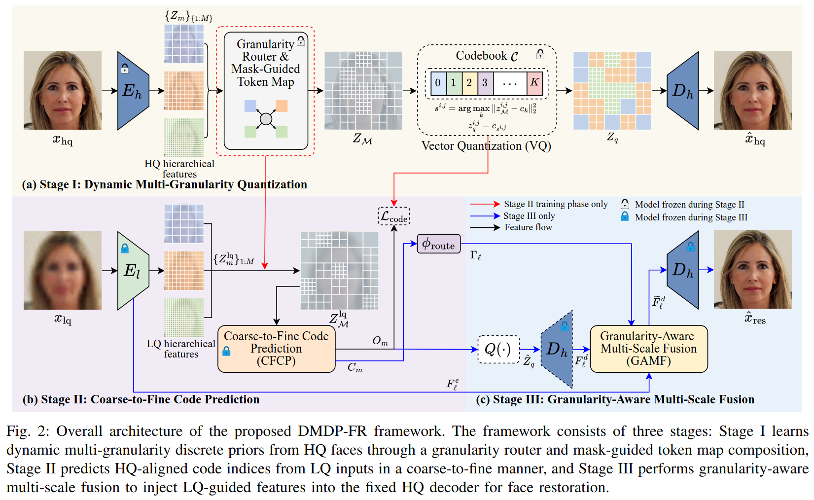
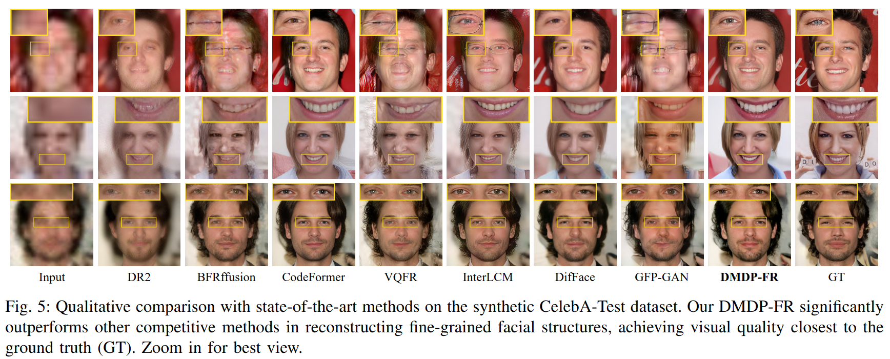
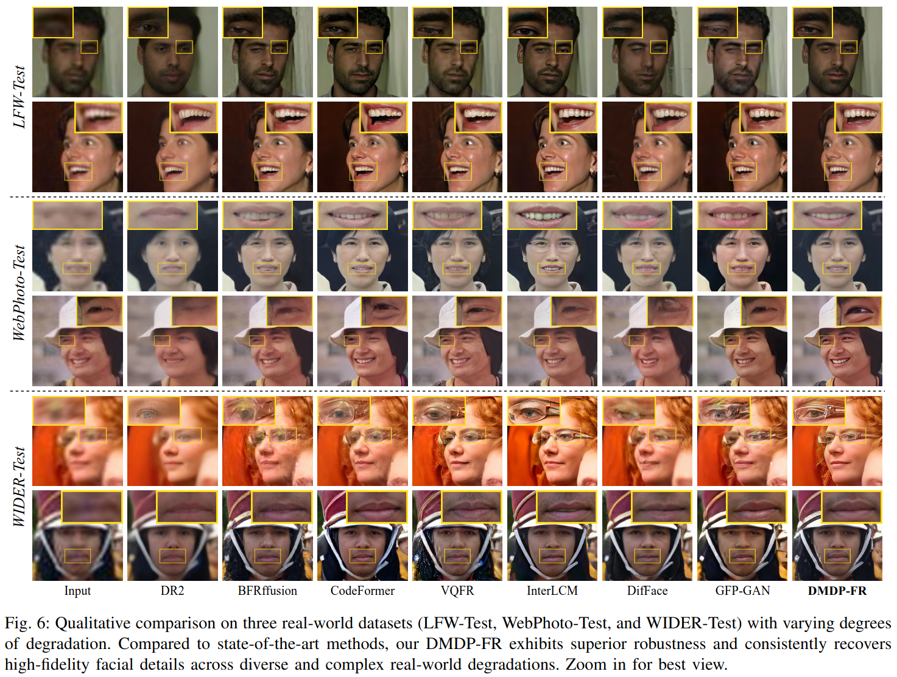
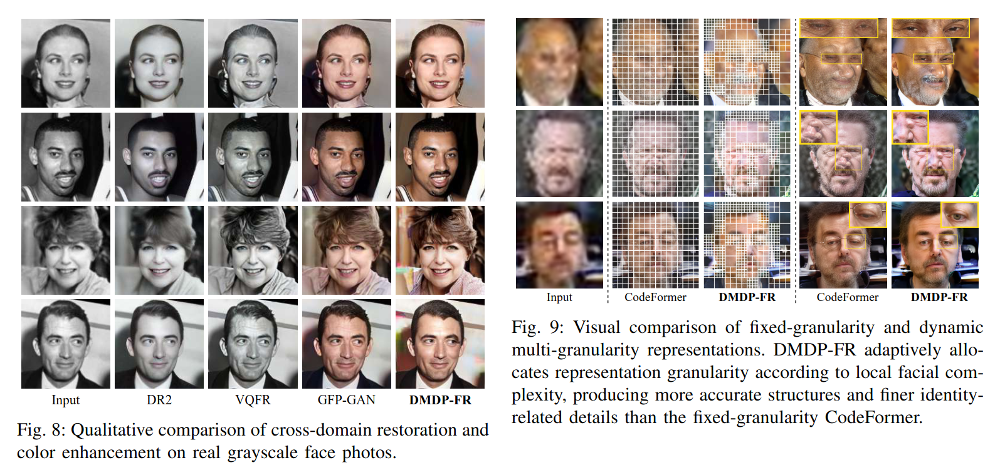

# DMDP-FR

Implementation of **DMDP-FR: Dynamic Multi-Granularity Discrete Prior Representation for Blind Face Restoration**. The repository includes the code path needed by DMDP-FR: dynamic DMGQ-VAE prior learning, coarse-to-fine code prediction, granularity-aware fusion, training configs, inference, and visualization/evaluation utilities.

[//]: # (> Note: the Python registry names use `DMDPFR` and `DMDPFRModel` because Python identifiers cannot contain `-`. User-facing files, commands, and documentation use the paper name `DMDP-FR`.)

## Framework

DMDP-FR restores blind degraded faces in three stages:

| Stage | Module | Purpose |
| --- | --- | --- |
| Stage I | Dynamic Multi-Granularity Quantization (DMGQ) | Learns a discrete HQ face prior with adaptive coarse/medium/fine token allocation. |
| Stage II | Coarse-to-Fine Code Prediction (CFCP) | Predicts HQ-aligned discrete codes from LQ inputs, recovering global structure before local details. |
| Stage III | Granularity-Aware Multi-Scale Fusion (GAMF) | Injects LQ-guided features into the fixed HQ decoder using predicted granularity distributions. |



## Results From The DMDP-FR

### Synthetic CelebA-Test

| Method | FID (lower) | LPIPS (lower) | NIQE (lower) | IDA (lower) | PSNR (higher) | SSIM (higher) |
| --- | ---: | ---: | ---: | ---: | ---: | ---: |
| DR2 | 88.504 | 0.484 | 5.656 | 1.203 | 20.805 | 0.609 |
| BFRffusion | 77.338 | 0.478 | 4.461 | 1.185 | 20.560 | 0.536 |
| DiffBIR | 69.962 | 0.375 | 5.184 | 1.073 | 21.707 | 0.615 |
| CodeFormer | 63.621 | 0.365 | 4.516 | **1.019** | 21.451 | 0.581 |
| RestoreFormer++ | 57.972 | 0.450 | 3.958 | 1.160 | 20.146 | 0.500 |
| VSPBFR | 56.725 | 0.434 | <u>3.466</u> | 1.195 | 20.114 | 0.526 |
| GPEN | 56.145 | 0.425 | 3.913 | 1.141 | 20.545 | 0.552 |
| VQFR | 55.456 | 0.463 | **3.314** | 1.197 | 19.487 | 0.481 |
| RestoreFormer | 55.425 | 0.463 | 4.003 | 1.179 | 20.149 | 0.500 |
| AuthFace | 54.624 | 0.389 | 6.378 | 1.136 | 20.618 | 0.567 |
| DAEFR | 52.987 | 0.388 | 4.417 | <u>1.044</u> | 19.932 | 0.559 |
| InterLCM | 51.524 | 0.398 | 3.943 | 1.103 | 20.061 | 0.541 |
| DifFace | <u>51.247</u> | <u>0.347</u> | 4.631 | 1.060 | <u>22.190</u> | <u>0.633</u> |
| GFP-GAN | **46.958** | 0.453 | 4.061 | 1.268 | 19.574 | 0.522 |
| DMDP-FR (ours) | 52.096 | **0.346** | 5.003 | **1.019** | **22.216** | **0.649** |



### Real-World Benchmarks

| Method | LFW FID (lower) | LFW MUSIQ (higher) | WebPhoto FID (lower) | WebPhoto MUSIQ (higher) | WIDER FID (lower) | WIDER MUSIQ (higher) |
| --- |----------------:|-------------------:|---------------------:|------------------------:|------------------:|---------------------:|
| DR2 |          58.414 |             69.578 |              119.802 |                  58.600 |            63.433 |               57.133 |
| BFRffusion |          51.731 |             69.606 |               87.577 |                  62.331 |            58.586 |               61.581 |
| RestoreFormer++ |          51.870 |             72.249 |        <u>77.637</u> |                  71.486 |            46.363 |               71.511 |
| DiffBIR |          48.337 |             70.836 |               89.463 |                  71.864 |            49.524 |               68.662 |
| RestoreFormer |          49.905 |             73.074 |               79.655 |                  69.840 |            51.474 |               67.840 |
| CodeFormer |          54.407 |             71.430 |               86.456 |                  74.000 |            40.012 |               69.310 |
| VSPBFR |   <u>47.781</u> |             74.737 |               78.739 |                  73.231 |            38.984 |               62.596 |
| GPEN |          57.582 |             73.590 |               95.207 |           <u>75.576</u> |            54.007 |               65.326 |
| VQFR |          51.821 |      <u>74.745</u> |               78.251 |                  72.009 |            45.122 |               64.013 |
| AuthFace |      **47.431** |             73.140 |               92.724 |                  72.991 |            43.351 |               63.325 |
| DAEFR |          48.849 |             73.840 |           **77.336** |                  72.708 |     <u>37.703</u> |               64.146 |
| InterLCM |          57.178 |             74.692 |               79.492 |              **75.798** |            41.685 |               65.447 |
| DifFace |          48.222 |             69.848 |               83.266 |                  65.170 |            37.915 |               65.121 |
| GFP-GAN |          51.499 |             73.569 |               91.539 |                  72.097 |            40.468 |           **72.814** |
| DMDP-FR (ours) |          49.973 |         **74.801** |               89.247 |                  70.770 |        **35.263** |        <u>71.868</u> |



### Ablation Summary

| Component | What It Adds |
| --- | --- |
| DMGQ | Adaptive token allocation for structurally complex facial regions. |
| CFCP | Hierarchical prediction that stabilizes global layout before fine details. |
| GAMF | Input-dependent feature fusion for perception-fidelity control. |
| Triple granularity `{16,32,64}` | Best reported WIDER-Test setting: FID 35.230 with 608 tokens and 0.0941 sec/img latency. |



## Requirements

| Item | Requirement |
| --- | --- |
| OS | Ubuntu 22.04 |
| Python | 3.10. Recommend using Anaconda or Miniconda. |
| PyTorch | 2.4 |
| GPU/CUDA | NVIDIA GPU with CUDA 12.1 |

## Installation

```bash
conda create -n dmdp-fr python=3.10 -y
conda activate dmdp-fr
pip install -r requirements.txt
```
```bash
cd basicsr
python setup.py develop
```

## Dataset Preparation

Keep all datasets under `./datasets/` and edit the `dataroot_*` fields in `options/*.yml` if your local paths are different.

### Training Dataset

DMDP-FR uses [FFHQ](https://github.com/NVlabs/ffhq-dataset) for all three training stages. The images should be aligned face images at `512x512`.

The original FFHQ images are `1024x1024`. Resize them to `512x512` before training. A simple layout is:

```text
datasets/
  ffhq/
    ffhq_512/
      00000.png
      00001.png
      ...
```

### Validation Dataset

Please put the following validation and testing datasets under the `./datasets/` folder.

| Datasets | Data Type | Short Description | Download |
| --- | --- | --- | --- |
| CelebA-Test | `gt + lq` | 3000 paired HQ/LQ images for full-reference evaluation | [GT: celeba_512_validation.zip](https://huggingface.co/datasets/LIAGM/DAEFR_test_datasets/resolve/main/celeba_512_validation.zip) / [LQ: self_celeba_512_v2.zip](https://huggingface.co/datasets/LIAGM/DAEFR_test_datasets/resolve/main/self_celeba_512_v2.zip) |
| LFW-Test | `lq only` | 1711 real-world LQ images for testing | [lfw_cropped_faces.zip](https://huggingface.co/datasets/LIAGM/DAEFR_test_datasets/resolve/main/lfw_cropped_faces.zip) |
| WebPhoto-Test | `lq only` | 407 real-world LQ images for testing | [WebPhoto-Test](https://github.com/TencentARC/GFPGAN) |
| WIDER-Test | `lq only` | 970 real-world LQ images for testing | [Wider-Test.zip](https://huggingface.co/datasets/LIAGM/DAEFR_test_datasets/resolve/main/Wider-Test.zip) |

For the default validation during training, prepare the paired CelebA-Test images under `datasets/faces/validation/`. The `gt` folder contains aligned HQ faces. The `lq` folder contains the corresponding degraded LQ faces for Stage-II and Stage-III validation.

```text
datasets/
  faces/
    validation/
      gt/
        000001.png
        000002.png
        ...
      lq/
        000001.png
        000002.png
        ...
```

For real-world testing, only LQ images are available. A recommended layout is:

```text
datasets/
  faces/
    real_world/
      lfw_test/
        lq/
          000001.png
          000002.png
          ...
      webphoto_test/
        lq/
          000001.png
          000002.png
          ...
      wider_test/
        lq/
          000001.png
          000002.png
          ...
```

### Optional Latent GT Cache

Stage-II and Stage-III can either generate DMGQ latent supervision online from `network_vqgan`, or read precomputed latent codes by setting `datasets.train.latent_gt_path` in the YAML config.

Generate the cache with:

```bash
python scripts/generate_dmgq_latent_gt.py \
  -i datasets/ffhq/ffhq_512 \
  --opt options/DMDP-FR_stage1_triple.yml \
  --ckpt_path experiments/pretrained_models/dmgqvae/dmgqvae_stage1_triple.pth \
  -o experiments/pretrained_models/dmgqvae
```

Then set, for example:

```yaml
datasets:
  train:
    latent_gt_path: experiments/pretrained_models/dmgqvae/latent_gt_dmgq_triple_code1024.pth
```

## Checkpoint Layout

```text
experiments/pretrained_models/
  dmgqvae/dmgqvae_stage1_triple.pth
  dmdp_fr_stage2/net_g_latest.pth
  dmdp_fr/dmdp_fr_stage3.pth
weights/
  lpips/vgg.pth
```

Stage-2 and Stage-3 use the DMGQ-VAE prior checkpoint through `stage1_model_path` and `network_vqgan.model_path`.

## Training

Train the triple-granularity DMGQ-VAE prior:

```bash
python basicsr/train.py -opt options/DMDP-FR_stage1_triple.yml
```

Optional dual prior:

```bash
python basicsr/train.py -opt options/DMDP-FR_stage1_dual.yml
```

Train Stage II coarse-to-fine code prediction:

```bash
python basicsr/train.py -opt options/DMDP-FR_stage2_triple.yml
```

Train Stage III granularity-aware fusion:

```bash
python basicsr/train.py -opt options/DMDP-FR_stage3_triple.yml
```

Distributed training example:

```bash
torchrun --nproc_per_node=4 --master_port=29434 basicsr/train.py -opt options/DMDP-FR_stage1_triple.yml --launcher pytorch
torchrun --nproc_per_node=4 --master_port=29435 basicsr/train.py -opt options/DMDP-FR_stage2_triple.yml --launcher pytorch
torchrun --nproc_per_node=4 --master_port=29436 basicsr/train.py -opt options/DMDP-FR_stage3_triple.yml --launcher pytorch
```

Optional task-specific configs:

```bash
python basicsr/train.py -opt options/DMDP-FR_colorization.yml
python basicsr/train.py -opt options/DMDP-FR_inpainting.yml
```

## Visualization And Evaluation

### With CelebA-Test

Use this setting for paired benchmarks such as CelebA-Test. The command saves restored images, LQ/restored/GT comparisons, granularity maps, and full-reference metrics.

```bash
python scripts/visualize_eval_dmdp_fr.py \
  -i datasets/faces/validation/lq \
  --gt_path datasets/faces/validation/gt \
  --opt options/DMDP-FR_stage3_triple.yml \
  --ckpt_path experiments/pretrained_models/dmdp_fr/dmdp_fr_stage3.pth \
  --fid_ref_path datasets/FFHQ \
  --save_comparison \
  --save_gate_map \
  --metrics fid,lpips,niqe,psnr,ssim \
  --w 1.0
```

### Without Real-World Benchmarks

Use this setting for real-world LQ-only benchmarks such as LFW-Test, WebPhoto-Test, and WIDER-Test. Do not pass `--gt_path`; use no-reference metrics such as `niqe` and `musiq`.

```bash
python scripts/visualize_eval_dmdp_fr.py \
  -i datasets/faces/real_world/lfw_test/lq \
  --opt options/DMDP-FR_stage3_triple.yml \
  --ckpt_path experiments/pretrained_models/dmdp_fr/dmdp_fr_stage3.pth \
  --fid_ref_path datasets/FFHQ \
  --save_comparison \
  --save_gate_map \
  --metrics fid,musiq \
  --w 0.0
```

Replace `datasets/faces/real_world/lfw_test/lq` with `datasets/faces/real_world/webphoto_test/lq` or `datasets/faces/real_world/wider_test/lq` for the other real-world test sets.

## Acknowledgement

We thank the authors and contributors of [BasicSR](https://github.com/XPixelGroup/BasicSR), [CodeFormer](https://github.com/sczhou/CodeFormer), [VQFR](https://github.com/TencentARC/VQFR), and [DAEFR](https://github.com/LIAGM/DAEFR) for making their code, models, and project resources publicly available.
